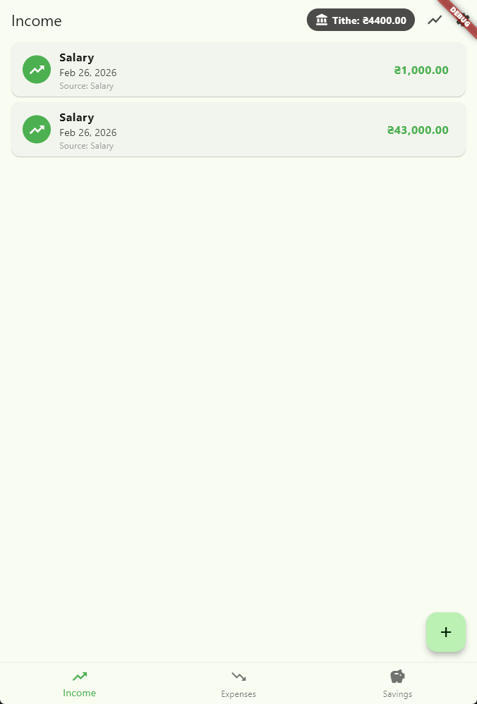
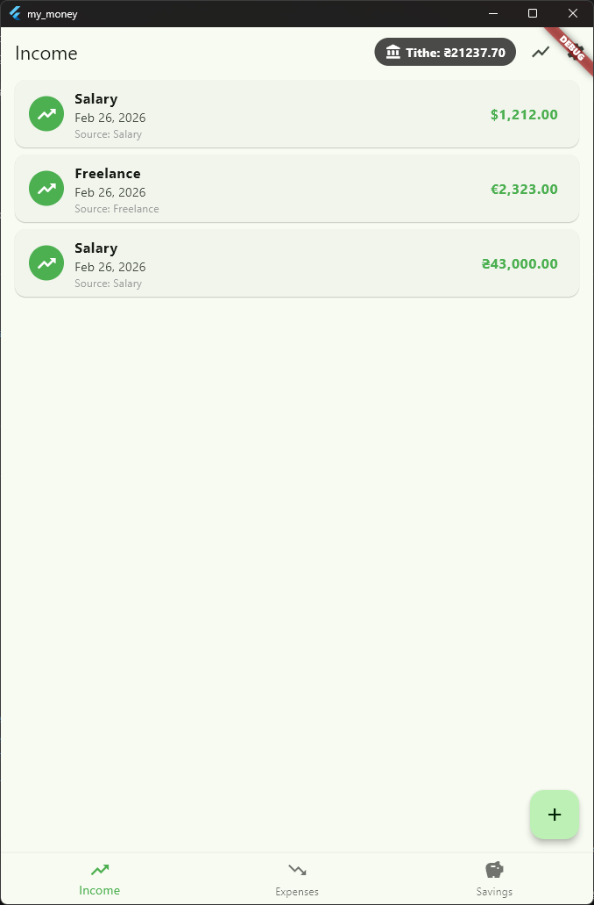
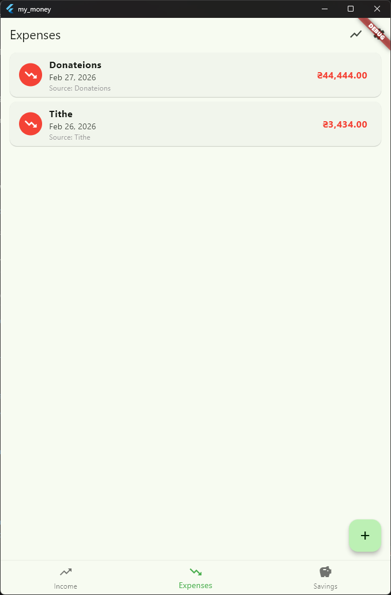
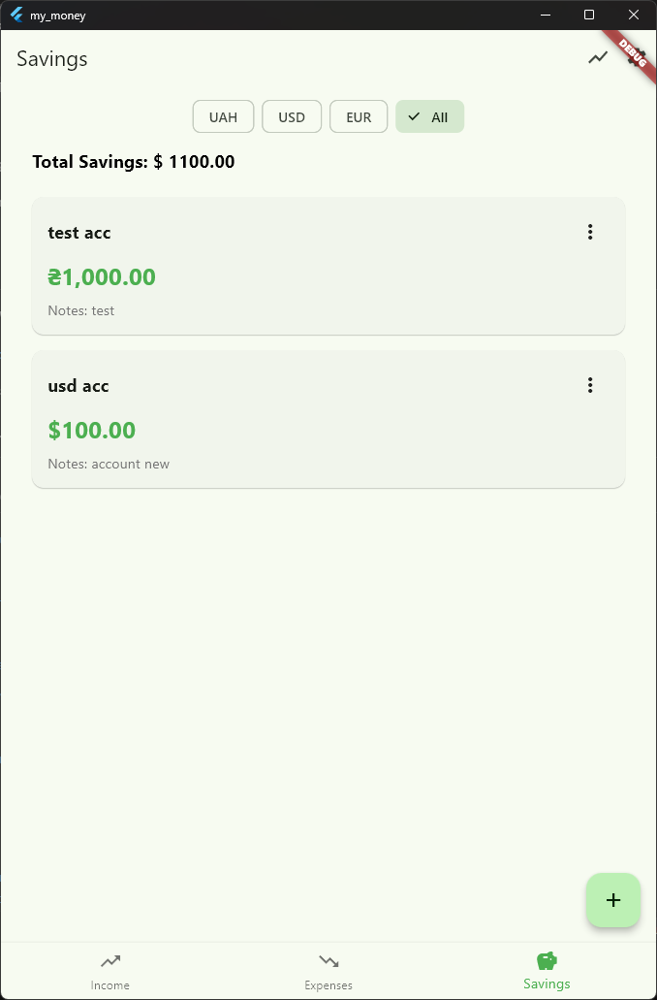

# 📚 MyMoney
CPU/GPU Converter from E-Book to audiobook with chapters and metadata<br/>
using XTTSv2, Piper-TTS, Vits, Fairseq, Tacotron2, YourTTS and much more.<br/>
Supports voice cloning and 1158 languages!
> [!IMPORTANT]
**This project is for personal use, are in development right now.** <br>

#### GUI Interface

<details>
<summary>Click to see video of App</summary>

</details>

<details>
  <summary>Click to see images of App</summary>
  
  
  
</details>


## README.md

## Table of Contents
- [Features](#features)
- [Instructions](#instructions)
- [Folder Structure](#folder-structure)
- [Resources](#resources)
- [Special Thanks](#special-thanks)


## Features
- 📚 **Add Income into User defined Categories**
- 📚 **Add Expences into User defined Categories**
- 📚 **Add Saving Accounts**
- 📚 **Supported Currency**: `UAH`, `USD`, `EUR`
- 📚 **Supported Language**: `English`


## Instructions 
1. **Clone repo**
	```bash
	git clone https://github.com/kodizhuk/MyMoney.git
	cd MyMoney
	```

2. **Install / Run**:
    - **Linux**  
      ```bash
        TODO
      ```
    - **Windows**  
      ```bash
        TODO
      ```
    - **Android**  
      ```bash
        flutter build apk
      ```
      the apk will be located here  build\app\outputs\flutter-apk\app-release.apk
3. **Common Issues**:
    - **CMake error** 
        - flutter clean
        - flutter build windows
        - flutter build apk
        - the apk will be located here build\app\outputs\flutter-apk\app-release.apk
     - **Database Location for windows**
     ```bash
        \MyMoney\.dart_tool\sqflite_common_ffi\databases
      ```

## Folder Structure
```bash
    assets - Images and GIFs for Readme

    models - Data models and classes
    |---transaction.dart - Transaction model (income/expense)
    |---category.dart - Category model for transaction types


    screens - UI screens/pages
    |---home_screen.dart - Main dashboard showing balance and recent transactions
    |---add_transaction_screen.dart - Screen to add new income/expense
    |---transaction_list_screen.dart - List of all transactions with filters
    |---statistics_screen.dart - Charts and analytics

    widgets - Reusable UI components
    |---transaction_item.dart - Individual transaction list item
    |---balance_card.dart - Balance display widget
    |---category_selector.dart - Dropdown/selector for categories

    services - Business logic and data handling
    |---database_service.dart - SQLite database operations
    |---transaction_service.dart - Transaction CRUD operations

    utils - Helper functions and constants
    |---constants.dart - App constants (colors, categories, etc.)
    |---date_formatter.dart - Date formatting utilities
```

ToDo List:
- [ ] Statistic Screen should show the graph for month and year
- [ ] Saving Screen make it look as many Credit cards
- [ ] Fix calculation for Tithe
- [ ] Income/Expence screen add filter option, as there will be a lot of data
- [ ] Add Different Language support 

### Resources
A few resources to get you started if this is your first Flutter project:

- [Lab: Write your first Flutter app](https://docs.flutter.dev/get-started/codelab)
- [Cookbook: Useful Flutter samples](https://docs.flutter.dev/cookbook)

For help getting started with Flutter development, view the
[online documentation](https://docs.flutter.dev/), which offers tutorials,
samples, guidance on mobile development, and a full API reference.flut
   


## Special Thanks
- **perplexity.ai**: for helping to learn the Dart and Flutter